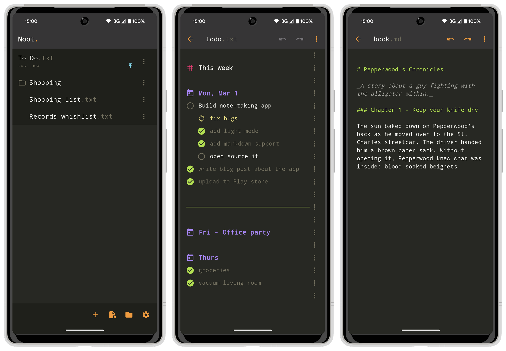

# Noot.

Noot is a new app for Android that is equal parts to-do list keeper, text
editor, journaling app, and Markdown editor. It revolves around using plain text
files for storage.


Back in 2020 I released a [plain text to-do file format and syntax highlighter
for Sublime Text](https://github.com/mlagerberg/todo?ref=mlagerberg.com). The
idea is simple: you write your checkboxes in a text file, with whatever editor
you want, and then check them off using a check-mark: 'v'. Syncing is your own
responsibility: you can use Git or Drive or Dropbox, or something more open like
Syncthing. Either way: no vendor lock-in. The 'back-end' is just a text file.

## Noot app

The app is a perfect companion for mobile for two big reasons:

- File editors on Android are almost always either offer poor UX, or are unsuited for simple .txt file editing, or are locked to a certain cloud provider.
- Typing a 'v' between to brackets is easy on a desktop keyboard, not so much on a phone.



**Download now on [Google Play](https://play.google.com/store/apps/details?id=com.droptablecompanies.todo)**

### Features

- A complete list manager that does not bug you but lets you organize your tasks the way you want it. Works equally well for your daily tasks as for a shopping list as for the list of movies your friends have recommended but you're probably not going to watch.
- Plain text editor. With markdown syntax highlighting.
- Rich text markdown editor.
- Light mode and dark mode (Monokai theme).
- Tablet layout included

## Quickstart

```
flutter pub get
``` 

Then run the app from Android Studio.

If the localization files are not automatically generated, run this command:

```
flutter gen-l10n
```

## Quirks

To allow wrapping in the code editor, we use a custom fork of
[flutter-code-editor](https://github.com/flutter/flutter-code-editor).
[This fork](https://github.com/mlagerberg/flutter-code-editor) fixes broken line
wrapping in the editor (at the cost of hiding line numbers), and adds a few
optimizations to squeeze out a bit of performance.

Note that, due to the way text editors in Flutter work, editing large files in
code mode is quite slow. I've attempted to improve performance of the code
editor package, but this is even a problem with a plain `TextField` widget.
I'm investigating how to build a replacement, but for the time being I suggest
editing large files with either the To-do mode or the built-in Markdown editor. 

## Create production builds

1. Update version number in the `pubspec.yaml`.
2. Build:

```
flutter gen-l10n
flutter build appbundle
```

This app is not (yet) compatible with iOS because of the way files are opened is
directly tailored to Android.

# Roadmap

There is no clear roadmap, as this is a side project that I am unable to put a
lot of time into. Here are improvements I want to make:

- Iron out bugs.
- Add toolbar buttons to make it easier to modify text style and markup.
- Publish on FDroid

I am also considering adding support for iOS. iOS does not let apps access a
shared file system, so files will have to be shared through iCloud. While this
goes against the 'use your own backend' philosophy, I'm open to work with
what's available and work on this anyway.

The full list of open tasks is, of course, in a [To-do-formatted plain text file](noot.todo.txt).

# Support

Like this app? 

[](https://ko-fi.com/mathijsl)

# License

This project uses the GNU GPLv3 license. See COPYING for the license in full.

```
Noot. Note-taking and todo-list app.
Copyright (C) 2025  Mathijs Lagerberg

This program is free software: you can redistribute it and/or modify
it under the terms of the GNU General Public License as published by
the Free Software Foundation, either version 3 of the License, or
(at your option) any later version.

This program is distributed in the hope that it will be useful,
but WITHOUT ANY WARRANTY; without even the implied warranty of
MERCHANTABILITY or FITNESS FOR A PARTICULAR PURPOSE.  See the
GNU General Public License for more details.

You should have received a copy of the GNU General Public License
along with this program.  If not, see <https://www.gnu.org/licenses/>.
```
